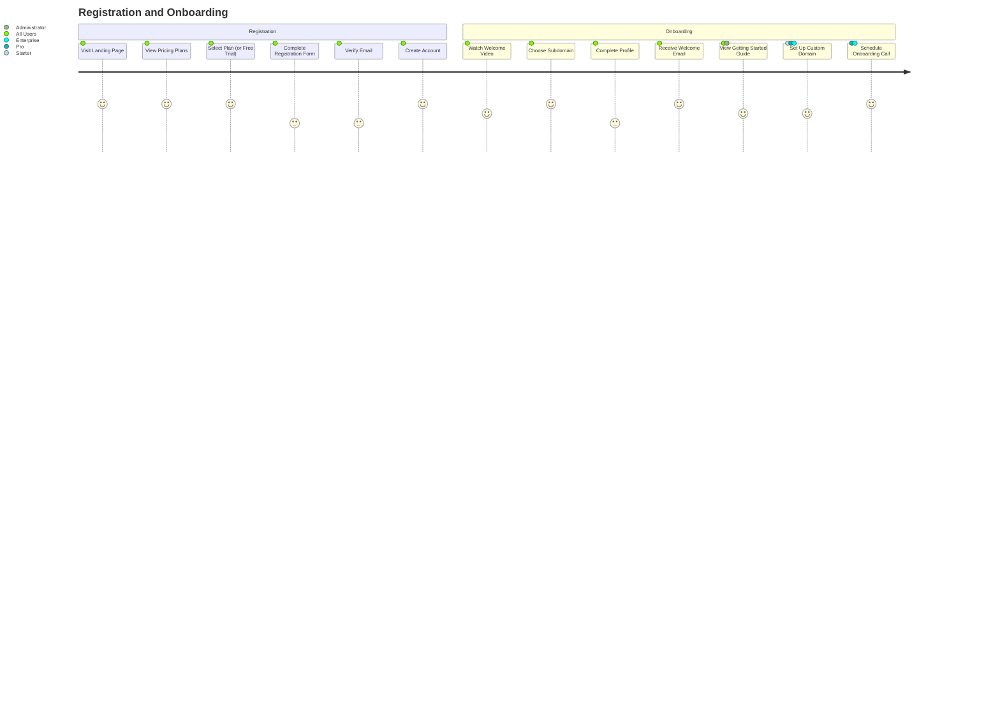
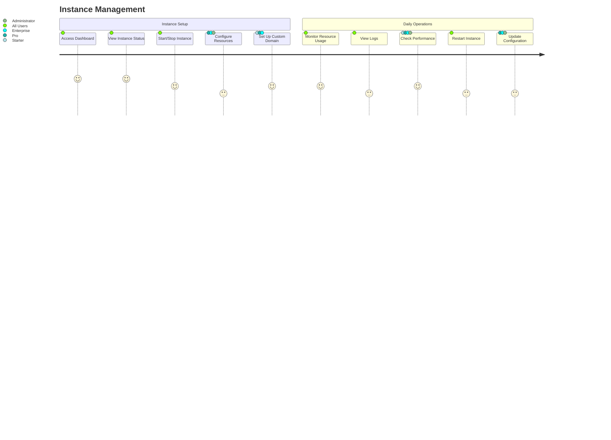
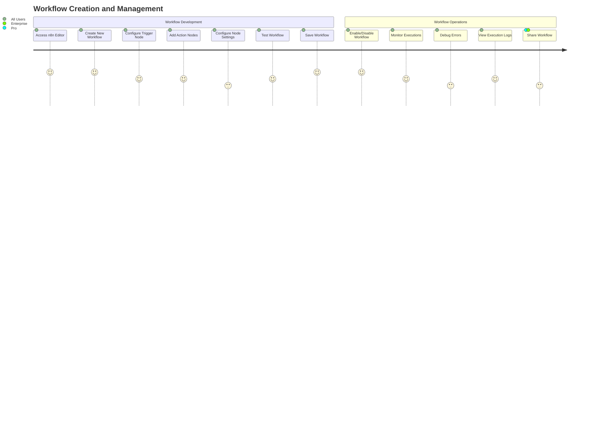
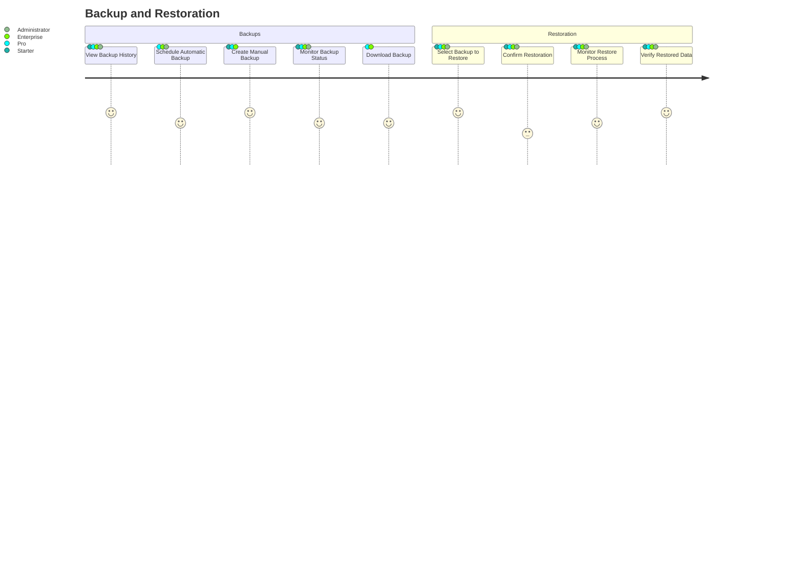
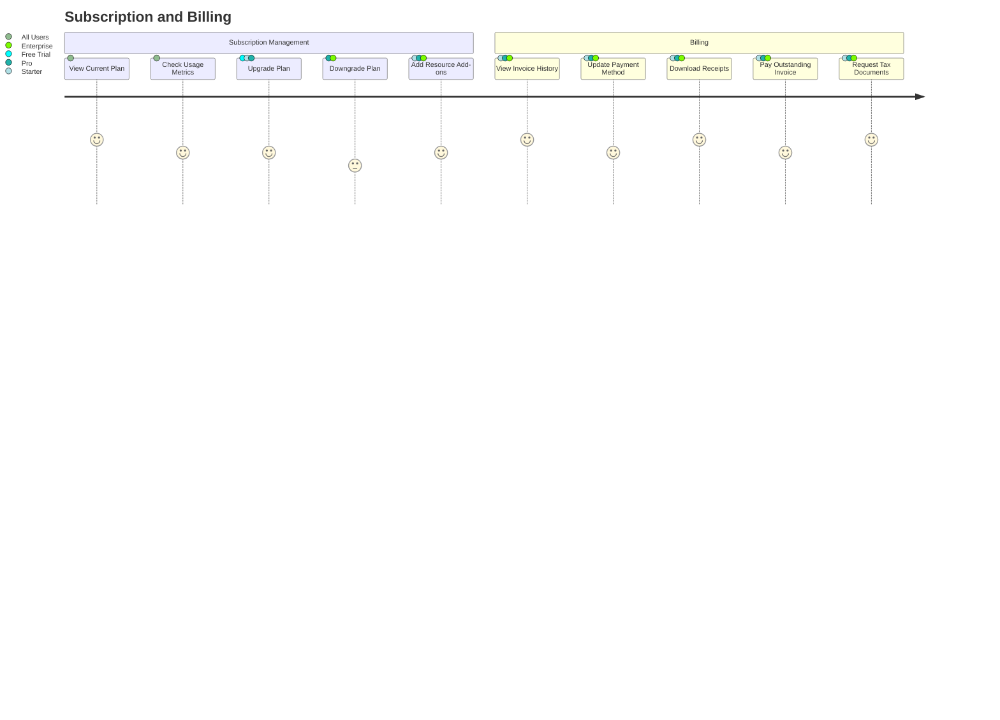
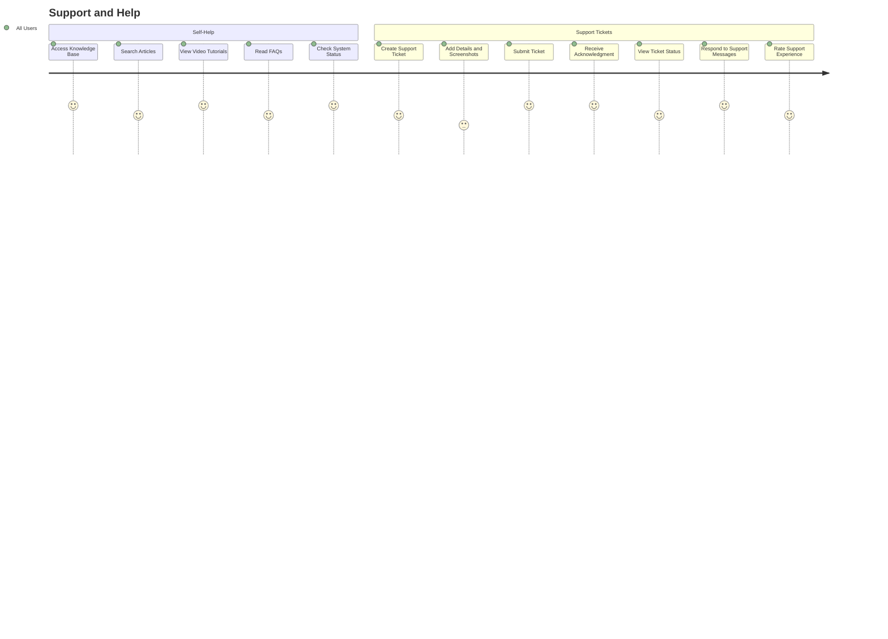
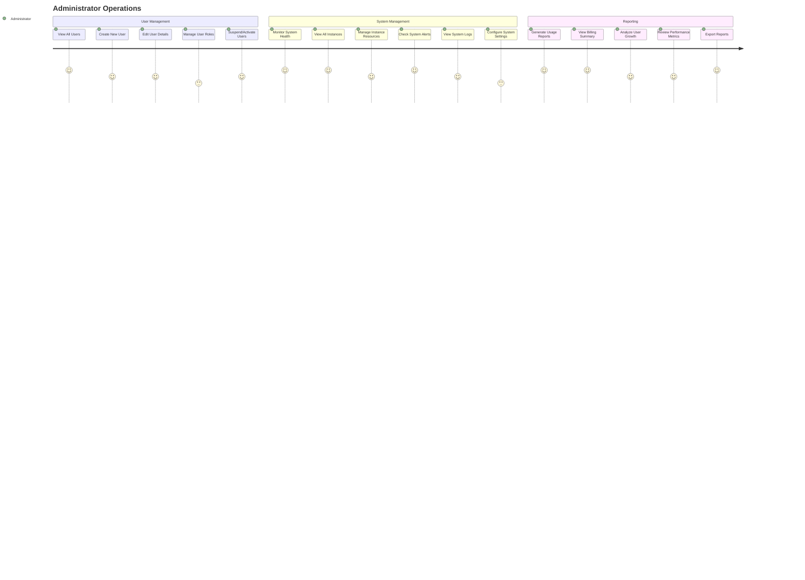

# n8nThai User Journeys

## Overview

This document outlines the complete user journeys for different user types in the n8nThai platform. It covers the step-by-step experience from initial registration through daily usage and advanced operations.

## User Types

1. **Free Trial User**: A user testing the platform with limited features
2. **Starter Plan User**: An individual developer or small business user
3. **Pro Plan User**: A business or agency with moderate automation needs
4. **Enterprise User**: A large organization with complex requirements
5. **Administrator**: Platform administrator managing the entire system

## User Journey 1: Registration and Onboarding

### Detailed Flow: Registration and Onboarding

1. **Visit Landing Page**
   - User lands on the n8nThai homepage
   - User views features, benefits, and Thai language toggle

2. **View Pricing Plans**
   - User reviews available plans and features
   - User compares plans side-by-side

3. **Select Plan**
   - User selects appropriate plan (or free trial)
   - System displays registration form

4. **Complete Registration Form**
   - User enters email, password, name, and organization details
   - User accepts terms and conditions
   - User fills in Thai tax information if applicable

5. **Verify Email**
   - System sends verification email
   - User clicks verification link
   - System confirms email verification

6. **Create Account**
   - System provisions new account
   - System creates subdomain (username.n8n.ipthai.top)
   - System sets up initial n8n instance with appropriate resources

7. **Onboarding**
   - System displays welcome dashboard
   - User watches introduction video
   - User completes profile information
   - User views getting started guide
   - Pro/Enterprise users schedule onboarding call

## User Journey 2: Instance Management

### Detailed Flow: Instance Management

1. **Access Dashboard**
   - User logs in to n8nThai platform
   - System displays instance dashboard with status indicators

2. **View Instance Status**
   - User sees current status (running, stopped, etc.)
   - User views resource utilization (CPU, RAM, Storage)
   - User checks workflow execution metrics

3. **Start/Stop Instance**
   - User clicks start/stop button
   - System updates instance status
   - System sends notification when operation completes

4. **Configure Resources** (Pro/Enterprise)
   - User accesses resource configuration panel
   - User adjusts RAM, CPU, or storage allocation
   - System applies changes and restarts instance if necessary

5. **Set Up Custom Domain**
   - User enters custom domain details
   - System provides DNS configuration instructions
   - User confirms DNS settings are updated
   - System provisions SSL certificate
   - System activates custom domain

## User Journey 3: Workflow Creation and Management

### Detailed Flow: Workflow Creation and Management

1. **Access n8n Editor**
   - User clicks "Access n8n" button from dashboard
   - System opens n8n editor in new tab
   - User sees n8n interface with Thai language support

2. **Create New Workflow**
   - User clicks "New Workflow" button
   - User enters workflow name and description
   - System creates new workflow canvas

3. **Configure Workflow**
   - User adds trigger node (webhook, schedule, etc.)
   - User configures trigger settings
   - User adds action nodes (API calls, data processing, etc.)
   - User configures node settings and connections
   - User tests workflow execution

4. **Save and Activate**
   - User saves workflow
   - User enables workflow for automatic execution
   - System confirms workflow is active

5. **Monitor and Manage**
   - User views execution history
   - User debugs errors when they occur
   - User optimizes workflow as needed
   - Pro/Enterprise users can share workflows with team members

## User Journey 4: Backup and Restoration

### Detailed Flow: Backup and Restoration

1. **View Backup History**
   - User accesses backup management section
   - System displays list of available backups with dates and statuses
   - User can filter or search backups

2. **Create Manual Backup**
   - User clicks "Create Backup" button
   - User enters backup description (optional)
   - System initiates backup process
   - User receives notification when backup completes

3. **Schedule Automatic Backup** (Pro/Enterprise)
   - User configures backup schedule (daily, hourly, etc.)
   - User sets retention policy
   - System confirms schedule

4. **Restore from Backup**
   - User selects backup to restore
   - System displays warning about overwriting current data
   - User confirms restoration
   - System initiates restore process
   - User receives notification when restore completes
   - User verifies restored data integrity

## User Journey 5: Subscription and Billing

### Detailed Flow: Subscription and Billing

1. **View Current Plan**
   - User accesses subscription page
   - System displays current plan details, usage, and limitations
   - User can view when next billing occurs

2. **Upgrade Plan**
   - User selects new plan tier
   - System calculates prorated amount
   - User confirms upgrade
   - User selects payment method
   - System processes payment
   - System provisions additional resources
   - User receives confirmation email

3. **Billing Management**
   - User views invoice history
   - User downloads Thai tax-compliant receipts
   - User updates payment methods
   - User requests additional tax documents if needed

## User Journey 6: Support and Help

### Detailed Flow: Support and Help

1. **Self-Help Resources**
   - User accesses knowledge base from dashboard
   - User searches for specific topics
   - User views relevant articles, tutorials, and FAQs
   - User finds solution or decides to contact support

2. **Create Support Ticket**
   - User clicks "Support" button
   - User selects issue category
   - User describes problem in detail
   - User attaches screenshots if applicable
   - User submits ticket
   - System sends confirmation email with ticket ID

3. **Ticket Management**
   - User can view all tickets and their statuses
   - User receives notifications when support responds
   - User can add additional information to the ticket
   - User can mark ticket as resolved when issue is fixed
   - User rates support experience

## User Journey 7: Admin Operations

### Detailed Flow: Administrator Operations

1. **User Management**
   - Admin accesses admin dashboard
   - Admin views list of all platform users
   - Admin can create, edit, or suspend user accounts
   - Admin can assign roles and permissions
   - Admin can view user activity logs

2. **Instance Management**
   - Admin views all n8n instances across the platform
   - Admin can start, stop, or restart any instance
   - Admin can modify resource allocations
   - Admin can access instance logs and metrics
   - Admin receives alerts for problematic instances

3. **System Monitoring**
   - Admin views system health dashboard
   - Admin checks resource utilization across the platform
   - Admin reviews system logs for issues
   - Admin configures monitoring thresholds and alerts
   - Admin accesses detailed performance metrics

4. **Reporting**
   - Admin generates usage reports
   - Admin reviews billing summaries
   - Admin analyzes user growth and retention
   - Admin monitors workflow execution statistics
   - Admin exports reports in various formats (CSV, Excel, PDF)

## Touchpoints and UI Components

Throughout these journeys, users interact with the following key touchpoints:

1. **Main Dashboard**
   - Instance status card
   - Resource usage indicators
   - Quick action buttons
   - Recent activity feed
   - Alerts and notifications

2. **User Profile**
   - Personal details
   - Organization information
   - Language preferences
   - Notification settings
   - Two-factor authentication

3. **Instance Manager**
   - Start/Stop controls
   - Resource allocation sliders
   - Domain configuration
   - Performance metrics
   - Logs viewer

4. **Backup Manager**
   - Backup history list
   - Create backup button
   - Restore options
   - Backup status indicators
   - Download links (Pro/Enterprise)

5. **Subscription Center**
   - Current plan details
   - Usage metrics
   - Upgrade/Downgrade options
   - Payment methods
   - Invoice history

6. **Support Center**
   - Knowledge base search
   - Video tutorials
   - Ticket creation form
   - Ticket status list
   - Live chat (Pro/Enterprise)

7. **Admin Dashboard**
   - User management table
   - System health indicators
   - Instance overview grid
   - Reporting tools
   - Configuration settings

## Multilingual Support

All user journeys are available in both Thai and English, with:

- Language toggle in the top navigation
- Consistent terminology across both languages
- Thai-specific formatting for dates, times, and currency
- Culture-specific UI elements and icons where appropriate
- Thai language support documentation

## Journey Enhancements and Automations

To improve the user experience, the following automations are implemented:

1. **Intelligent Onboarding**
   - Personalized getting started steps based on user role and plan
   - Contextual tips and hints during first-time actions
   - Progress tracking for onboarding steps

2. **Proactive Notifications**
   - Instance resource warnings before limits are reached
   - Upcoming billing reminders
   - Workflow execution issues alerts
   - System maintenance announcements
   - Backup success/failure notifications

3. **Smart Suggestions**
   - Recommended resource allocations based on usage patterns
   - Workflow optimization suggestions
   - Plan upgrade recommendations when approaching limits
   - Relevant knowledge base articles based on user activity

4. **Streamlined Workflows**
   - One-click restore options
   - Single-click plan upgrades
   - Integrated support from any page
   - Quick access to n8n instance from dashboard

These user journeys provide a comprehensive view of how different users will interact with the n8nThai platform, from initial registration through to advanced management tasks.
